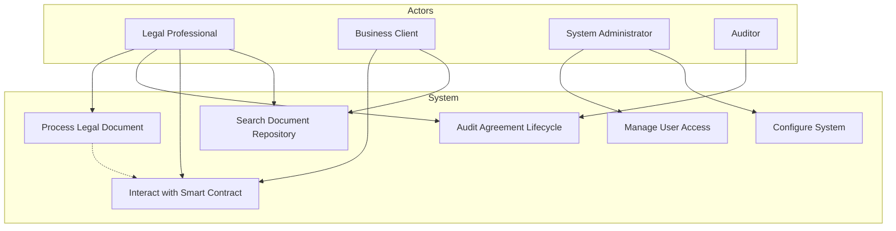
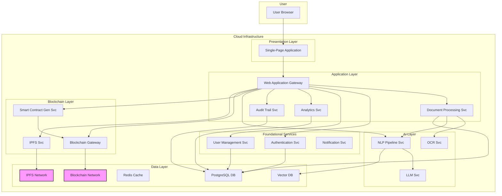
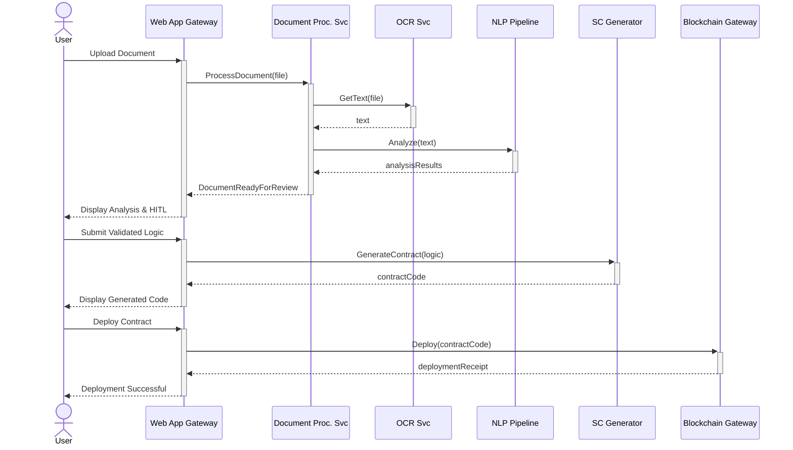

**SECTION 1: Research Problem**
======================================================

### Current Challenges

The management of legal documents is fraught with challenges that impede efficiency, transparency, and security. Traditional processes are manually intensive, leading to high operational costs, prolonged turnaround times, and a significant risk of human error. Key challenges include:

*   **Opacity and Lack of Trust:** Centralized storage of legal agreements creates information silos, making it difficult for all stakeholders to have a single source of truth. This opacity can lead to disputes and a fundamental lack of trust.
*   **Inefficiency and High Costs:** Manual review, verification, and execution of legal clauses are time-consuming and require expensive legal expertise for even routine tasks.
*   **Data Integrity and Security Risks:** Physical documents and centralized digital systems are vulnerable to tampering, unauthorized access, and data loss, which has severe implications for sensitive legal information.
*   **Complex Compliance and Auditability:** Tracking compliance with contractual obligations and generating audit trails is a cumbersome, often manual process, making it difficult to ensure and prove regulatory adherence.
*   **Static Nature of Agreements:** Traditional legal documents are static. They cannot automatically react to events, enforce obligations, or trigger payments, requiring constant manual oversight and intervention.

### Research Gap

While blockchain offers immutability and AI provides automation, a significant research gap exists in their holistic integration to address the *entire legal document lifecycle*. Existing research often focuses on narrow slices of the problem, such as:

1.  Using blockchain for simple notarization (timestamping a document hash).
2.  Applying NLP for contract analysis *without* a verifiable execution component.
3.  Generating smart contracts that are disconnected from the original legal prose and lack a human-in-the-loop validation mechanism.

There is a lack of a comprehensive, intelligent framework that seamlessly bridges the gap between the semantic complexity of a legal document and the deterministic logic of a smart contract, while ensuring continuous, verifiable, and automated lifecycle management on a blockchain.

### Existing Solutions

Current solutions offer partial remedies:

*   **Document Management Systems (DMS):** Platforms like DocuSign and Adobe Sign digitize agreements and signatures but do not automate the underlying contractual obligations or provide decentralized verification.
*   **Contract Lifecycle Management (CLM) Software:** Tools like Icertis or SAP Ariba automate workflows but are centralized systems, lacking the trust and immutability guarantees of blockchain.
*   **AI-Powered Contract Analysis Tools:** Companies like Kira Systems and LawGeex use NLP to analyze contracts for due diligence but do not translate them into executable smart contracts or manage their post-signature lifecycle.
*   **Blockchain Notarization Services:** Several platforms allow for hashing documents on a public blockchain, but this only proves the existence and integrity of a document at a point in time, not its automated execution.

### Limitations

The primary limitation of these existing solutions is their siloed nature. They fail to provide an end-to-end, trusted, and automated ecosystem. DMS and CLM systems are centralized, creating a single point of failure and control. AI analysis tools are disconnected from execution, and blockchain solutions are often too simplistic, ignoring the nuanced language of legal agreements.

### Novel Contribution & Research Novelty

The novel contribution of this research is the design and implementation of an **Intelligent Legal Document Lifecycle Management (ILDLM) Framework**. The novelty lies in the symbiotic integration of four key technologies, framed within our specified architectural layers:

1.  **AI Layer:** Moving beyond simple clause extraction to create a sophisticated **semantic-to-logic pipeline**. This pipeline translates ambiguous legal prose into deterministic, verifiable conditions suitable for smart contract generation, using a combination of advanced NLP, knowledge graphs, and Large Language Models (LLMs) with a robust human-in-the-loop (HITL) validation process.
2.  **Blockchain Layer:** Utilizing a permissioned blockchain (Hyperledger Fabric) not just for notarization, but as an **active execution engine**. The framework ensures that the generated smart contracts are the single source of truth for the state of the agreement, with all actions and state changes recorded immutably.
3.  **Application Layer:** Providing a unified platform that manages the entire lifecycle—from upload and AI-driven analysis to one-click smart contract deployment, real-time monitoring, and automated compliance reporting.
4.  **Research Layer:** Establishing a formal methodology and a set of evaluation metrics to quantitatively assess the framework's effectiveness in terms of legal accuracy, operational efficiency (gas costs, latency), and security, creating a reproducible research artifact.

### Expected Research Contribution

The expected research contribution is threefold:

1.  **A Novel Framework:** A formally defined and empirically evaluated framework (ILDLM) for integrating AI and blockchain in the legal domain.
2.  **A New Methodology:** A methodology for the verifiable translation of legal text into executable smart contracts, complete with metrics for evaluating the fidelity of this translation.
3.  **An Empirical Baseline:** A public dataset (anonymized) and a set of performance benchmarks that future researchers can use to evaluate new algorithms and approaches in this domain.

### Expected Startup Value

The ILDLM framework serves as the core IP for a highly defensible deep-tech startup. The value proposition includes:

*   **Significant Cost Reduction:** Automating manual legal work reduces operational costs for law firms, corporate legal departments, and government agencies.
*   **Enhanced Efficiency & Speed:** Drastically accelerating the contract lifecycle from negotiation to execution and management.
*   **Unprecedented Transparency & Trust:** Providing all parties with a shared, immutable record of agreements and their execution, reducing disputes and litigation risk.
*   **New Service Models (SaaS):** Offering a multi-tenant SaaS platform with subscription tiers, an API marketplace for third-party integrations, and specialized versions for enterprise, government, and law firm clients, creating recurring revenue streams.
*   **Patentable IP:** The novel semantic-to-logic pipeline and the integrated system architecture represent significant, patentable intellectual property.

---
======================================================
**SECTION 2: Functional Requirements**
======================================================

Here is a detailed breakdown of the system's functional requirements, grouped by capability area for clarity.

### 1. Core Document & Contract Lifecycle Management
*   **FR-DOC-01: Document Upload:** Users must be able to upload legal documents in various formats (e.g., .pdf, .docx, .txt), including scanned documents that will trigger an Optical Character Recognition (OCR) process.
*   **FR-DOC-02: Document Versioning:** The system must manage multiple versions of a document, allowing users to track changes, compare differences between versions, and view a complete revision history.
*   **FR-DOC-03: Secure Document Storage:** The system must securely store uploaded documents and their metadata. For enhanced integrity, it may use a distributed file system like IPFS.
*   **FR-DOC-04: Document Classification:** The system shall automatically classify the type of legal document (e.g., "Non-Disclosure Agreement," "Lease Agreement," "Employment Contract") upon upload.

### 2. AI-Powered Analysis & Processing
*   **FR-AI-01: Clause Extraction:** The system must identify and extract individual clauses, paragraphs, and sections from the legal text.
*   **FR-AI-02: Named Entity Recognition (NER):** The system shall identify and categorize key legal entities such as Party Names, Dates, Jurisdictions, Monetary Values, and specific Obligations/Entitlements.
*   **FR-AI-03: Legal Language Explanation (Plain English):** The system must be able to translate complex legal jargon from extracted clauses into simple, easy-to-understand language for non-expert users.
*   **FR-AI-04: Risk Detection:** The system shall analyze clauses and flag them as potentially risky, ambiguous, or non-standard based on predefined rules and learned patterns.
*   **FR-AI-05: Document Summarization:** The system must generate a concise, abstractive summary highlighting the key terms and obligations of the legal document.

### 3. Smart Contract & Blockchain Integration
*   **FR-SC-01: Logic Generation:** The system must translate extracted clauses and entities into a structured, logical format (e.g., IF-THEN rules, state machine) suitable for smart contract generation.
*   **FR-SC-02: Human-in-the-Loop (HITL) Validation:** The system must present the original clause, the plain English explanation, and the generated logic side-by-side for a human expert to review, edit, and approve before code generation.
*   **FR-SC-03: Smart Contract Generation:** Upon approval, the system shall automatically generate smart contract code (e.g., Solidity, or Chaincode in Go/Java for Hyperledger Fabric) based on the validated logic.
*   **FR-SC-04: Automated Code Validation:** The system should perform automated static analysis on the generated smart contract to check for common vulnerabilities (e.g., re-entrancy, integer overflow).
*   **FR-SC-05: Smart Contract Deployment:** Authorized users must be able to deploy the generated smart contract to the target blockchain network through the UI.
*   **FR-SC-06: Document Hashing (Notarization):** The system must compute a cryptographic hash of the final legal document and anchor it on the blockchain, creating an immutable timestamp and proof of integrity.
*   **FR-SC-07: Contract Interaction Interface:** The system must provide a user interface to interact with the deployed smart contract, allowing users to trigger its functions (e.g., `makePayment`, `fulfillObligation`) and view its current state.

### 4. User, Team & System Administration
*   **FR-USR-01: User Authentication:** Users must be able to register and log in to the system securely, with support for multi-factor authentication (MFA).
*   **FR-USR-02: Role-Based Access Control (RBAC):** The system must support different user roles (e.g., Admin, Lawyer, Client, Auditor) with granular permissions for accessing features and documents.
*   **FR-USR-03: Organization & Team Management:** The system should allow users to be grouped into organizations or teams, with shared access to documents, billing, and settings.
*   **FR-USR-04: Admin Panel:** A dedicated interface for system administrators to manage users, organizations, system configurations, and monitor overall platform health.

### 5. Search, Analytics & Reporting
*   **FR-REP-01: Semantic Search:** Users must be able to search across their entire document repository using natural language queries (e.g., "find all NDAs with a term longer than 3 years") and not just keywords.
*   **FR-REP-02: Analytics Dashboard:** The system shall provide a dashboard visualizing key metrics, such as the number of active contracts, upcoming deadlines, compliance status, and transaction throughput.
*   **FR-REP-03: Immutable Audit Trail:** The system must generate a complete, tamper-proof audit trail for every document, tracking all actions (view, edit, approval, deployment) and linking them to user identities and blockchain transaction IDs.
*   **FR-REP-04: Compliance Reporting:** The system should allow users to generate reports demonstrating compliance with contractual obligations and, where applicable, regulatory requirements.

### 6. Platform Extensibility & User Experience
*   **FR-PLT-01: API Access:** The system must expose a secure REST or GraphQL API for programmatic access to its functionalities, enabling integration with other enterprise systems.
*   **FR-PLT-02: Notifications:** The system shall send automated email or in-app notifications to users about important events, such as required approvals, upcoming deadlines, or contract state changes.
*   **FR-PLT-03: User Feedback:** The system should include a mechanism for users to provide feedback on the accuracy of AI predictions (e.g., a thumbs up/down on a clause explanation) to facilitate continuous model improvement.

---
======================================================
**SECTION 3: Non-Functional Requirements (NFRs)**
======================================================

This section defines the quality attributes, constraints, and standards the system must adhere to.

*   **NFR-01: Security**
    *   **Description:** The system must protect data from unauthorized access, use, disclosure, alteration, or destruction. This applies to document content, user data, and blockchain transactions.
    *   **Requirements:**
        *   **Data Encryption:** All data at rest (e.g., in databases, file storage) and in transit (e.g., API calls, user traffic) must be encrypted using industry-standard algorithms (AES-256, TLS 1.3).
        *   **Authentication & Authorization:** Enforce robust authentication with Multi-Factor Authentication (MFA) and granular authorization using Role-Based Access Control (RBAC), as defined in FR-USR-01 and FR-USR-02.
        *   **Threat Mitigation:** Adhere to a strict threat model (e.g., STRIDE) and actively protect against common web (OWASP Top 10) and smart contract (SWC Registry) vulnerabilities.
        *   **Immutability & Non-Repudiation:** Leverage the blockchain to guarantee the integrity of document hashes and audit trails, making actions scientifically and legally non-repudiable.

*   **NFR-02: Scalability**
    *   **Description:** The system must handle a growing number of users, documents, and transactions without degradation in performance.
    *   **Requirements:**
        *   **Horizontal Scaling:** The application and AI layers must be designed as stateless microservices that can be scaled horizontally using container orchestration (e.g., Kubernetes).
        *   **Blockchain Throughput:** The chosen blockchain (Hyperledger Fabric) and its configuration must support a target of at least 1,000 transactions per second (TPS) for core state changes.
        *   **Document Volume:** The architecture must support the ingestion, processing, and storage of millions of legal documents.

*   **NFR-03: Performance**
    *   **Description:** The system must be responsive and efficient under defined loads.
    *   **Requirements:**
        *   **API Response Time:** 95% of all API calls for synchronous operations should return in under 250ms.
        *   **Document Processing Time:** The median time from document upload to full AI analysis and logic generation should be under 60 seconds for a standard 10-page document.
        *   **UI Latency:** Critical user interface interactions (e.g., page loads, search results) should complete in under 2 seconds.

*   **NFR-04: Availability**
    *   **Description:** The system must be operational and accessible to users.
    *   **Requirements:**
        *   **Uptime:** The platform must achieve 99.9% uptime (less than 8.76 hours of downtime per year), excluding planned maintenance windows.
        *   **Redundancy:** All critical components (services, databases, blockchain nodes) must be deployed in a high-availability configuration across multiple availability zones (AZs).
        *   **Disaster Recovery:** A disaster recovery plan must be in place with a Recovery Time Objective (RTO) of less than 4 hours and a Recovery Point Objective (RPO) of less than 1 hour.

*   **NFR-05: Reliability**
    *   **Description:** The system must perform its specified functions correctly and consistently over time.
    *   **Requirements:**
        *   **Data Integrity:** The system must ensure zero data corruption during storage or processing. All data transformations must be traceable and reversible where appropriate.
        *   **Transactional Integrity:** All operations that change system state, especially those involving the blockchain, must be atomic and handle failures gracefully to prevent inconsistent states.
        *   **Error Rate:** The application-level error rate for unhandled exceptions should be below 0.1%.

*   **NFR-06: Privacy**
    *   **Description:** The system must protect user and document data in accordance with global privacy regulations.
    *   **Requirements:**
        *   **Regulatory Compliance:** The system must be designed to comply with GDPR, CCPA, and other relevant data protection regulations.
        *   **Data Anonymization:** The system must provide tools for data anonymization to create datasets for research and model training without exposing personally identifiable information (PII).
        *   **Private Data Channels:** Utilize Hyperledger Fabric's private data collections or channels to ensure that only authorized parties can view sensitive contract details, even on a permissioned blockchain.

*   **NFR-07: Explainability (XAI)**
    *   **Description:** The AI/ML models must provide clear and understandable explanations for their outputs to build trust and support validation.
    *   **Requirements:**
        *   **Clause-to-Logic Traceability:** For every piece of generated smart contract logic, the system must be able to trace it back to the specific source clause(s) in the original document.
        *   **Risk Highlighting:** When a risk is flagged, the system must highlight the specific text and provide a concise reason for the flag (e.g., "This indemnity clause is one-sided and lacks a liability cap").

*   **NFR-08: Maintainability**
    *   **Description:** The system should be easy to modify, correct, and improve.
    *   **Requirements:**
        *   **Modular Architecture:** The system will be built on a microservices architecture to ensure loose coupling and independent deployability of components.
        *   **Automated DevOps:** A full CI/CD pipeline must be implemented for automated building, testing, and deployment to ensure rapid and reliable updates.
        *   **Code Quality:** Code must adhere to strict style guides, be well-documented, and maintain a minimum of 80% unit test coverage.

*   **NFR-09: Usability**
    *   **Description:** The system must be intuitive, efficient, and satisfying to use for the target stakeholders (who may not be tech-savvy).
    *   **Requirements:**
        *   **Minimal Training:** A new legal professional should be able to successfully upload, analyze, and validate their first document with minimal to no formal training.
        *   **User Satisfaction:** Achieve a System Usability Scale (SUS) score of 80 or higher through regular user testing.

*   **NFR-10: Accessibility**
    *   **Description:** The system should be usable by people with a wide range of disabilities.
    *   **Requirements:**
        *   **WCAG Compliance:** The web-based user interface must comply with the Web Content Accessibility Guidelines (WCAG) 2.1 at the AA level.

---
======================================================
**SECTION 4: Stakeholders**
======================================================

This section identifies the key stakeholders who will use, benefit from, regulate, or develop the system.

### 1. Legal & Corporate Stakeholders (Primary Users)

*   **Lawyers / Legal Professionals:**
    *   **Role:** Draft, review, and manage legal agreements.
    *   **Interest:** To increase efficiency, reduce manual work, minimize errors, and gain deeper insights into contracts. They are power users of the analysis, generation, and validation features.
*   **Legal Firms:**
    *   **Role:** A business entity providing legal services.
    *   **Interest:** To offer more competitive, tech-enabled services, reduce overhead, improve client outcomes, and create new revenue streams based on platform efficiency.
*   **Corporate Legal Departments:**
    *   **Role:** In-house legal teams managing a company's contracts and compliance.
    *   **Interest:** To streamline contract lifecycle management, ensure regulatory compliance, manage risk across a large volume of agreements, and control legal spending.
*   **Clients / Business Users:**
    *   **Role:** Individuals or business units who are parties to a legal agreement (e.g., sales teams, procurement managers).
    *   **Interest:** To understand their rights and obligations without deep legal expertise (using the "Plain English" feature), track contract status, and receive automated alerts for key dates and milestones.

### 2. Government & Regulatory Stakeholders

*   **Government Agencies:**
    *   **Role:** Users of the system for public contracts, procurement, and internal legal document management.
    *   **Interest:** To enhance transparency, ensure public accountability, reduce fraud, and create efficient, auditable digital processes for government contracting.
*   **Judges / Judiciary:**
    *   **Role:** Adjudicators of legal disputes.
    *   **Interest:** To access a verifiable, immutable record of an agreement and its performance history. The system's audit trail can serve as powerful digital evidence, potentially simplifying dispute resolution.
*   **Regulatory & Compliance Bodies:**
    *   **Role:** Entities that oversee adherence to laws and standards.
    *   **Interest:** To use the system's reporting and audit features to easily verify compliance with industry-specific regulations (e.g., finance, healthcare).

### 3. Academic & Research Stakeholders

*   **Researchers (Legal Tech, AI, Blockchain):**
    *   **Role:** Academics studying the intersection of law and technology.
    *   **Interest:** To use the system's research layer, including anonymized datasets and performance metrics, to conduct studies, validate new models, and publish findings.
*   **Universities / Law Schools:**
    *   **Role:** Educational institutions training the next generation of lawyers.
    *   **Interest:** To use the platform as a teaching tool to educate students on modern legal technology and the future of contract law.

### 4. Internal & Operational Stakeholders

*   **Product Manager:**
    *   **Role:** Defines the product vision, strategy, and feature roadmap.
    *   **Interest:** To ensure the system meets the needs of all other stakeholders and achieves its business goals (PhD artifact, commercial MVP).
*   **Software Developers (AI/ML, Backend, Frontend, Blockchain):**
    *   **Role:** Design, build, and test the software.
    *   **Interest:** To have a clear architecture, well-defined requirements, and robust development tools to build a high-quality, maintainable system.
*   **System Administrator / DevOps Engineer:**
    *   **Role:** Deploy, monitor, and maintain the system's infrastructure.
    *   **Interest:** To ensure the system meets its NFRs (availability, scalability, security) and to have powerful monitoring and management tools.
*   **UX Researchers & Designers:**
    *   **Role:** Ensure the system is usable, intuitive, and valuable to the end-users.
    *   **Interest:** To conduct user research, create user-friendly interfaces, and validate that the system solves real-world problems for legal professionals.

---
======================================================
**SECTION 5: Use Cases**
======================================================

This section details the system's use cases, actors, and their interactions.

### Actors

Based on the stakeholder analysis, we can define the following primary actors who interact directly with the system:

*   **Legal Professional:** A power user responsible for uploading, analyzing, validating, and managing the lifecycle of legal agreements. (Corresponds to Lawyers, Corporate Legal Depts).
*   **Business Client:** A party to the contract who uses the system to understand obligations, track status, and interact with the contract's functions. (Corresponds to Clients, Business Users).
*   **System Administrator:** An internal user responsible for managing users, organizations, and overall system configuration.
*   **Auditor:** An external or internal user who needs read-only access to verifiable audit trails and compliance reports. (Corresponds to Judges, Regulators).

### Use Case Diagram

The following diagram is provided in Mermaid syntax. This can be rendered into a visual diagram by compatible editors and platforms.



### Use Case Descriptions

Here are detailed descriptions for the primary use cases.

---

#### **UC-1: Process Legal Document**

*   **Actor:** Legal Professional
*   **Description:** This use case covers the end-to-end workflow of taking a raw legal document, analyzing it, generating a smart contract, and deploying it.
*   **Main Flow:**
    1.  The Legal Professional logs into the system.
    2.  They initiate a new contract process and upload a document file (.pdf, .docx).
    3.  The system performs OCR (if needed) and ingests the text.
    4.  The system automatically performs AI analysis: document classification, clause extraction, NER, risk detection, and summarization.
    5.  The system presents the analysis results to the Legal Professional in a dashboard view.
    6.  The system generates a structured logical representation (IF-THEN rules) for each operational clause.
    7.  The Legal Professional enters the Human-in-the-Loop (HITL) validation screen. For each key clause, they review the original text, the plain English summary, and the generated logic.
    8.  The Legal Professional approves or edits the logic for each clause.
    9.  Once all logic is validated, the Legal Professional clicks "Generate Smart Contract".
    10. The system generates the smart contract code and runs automated validation checks.
    11. The Legal Professional reviews the generated code and the validation report.
    12. They click "Deploy". The system deploys the smart contract to the blockchain.
    13. The system also hashes the original document and anchors it to the blockchain.
    14. The system confirms successful deployment and provides the contract address and transaction details.
*   **Alternative Flow:**
    *   At step 8, if the Legal Professional finds the generated logic insufficient, they can manually rewrite or create new logical rules using a provided interface.
*   **Exception Flow:**
    *   At step 4, if the document is unreadable or in an unsupported format, the system notifies the user and terminates the process.
    *   At step 12, if the smart contract deployment fails (e.g., due to insufficient gas, network error), the system notifies the Legal Professional with an error message and allows them to retry.

---

#### **UC-2: Manage User Access**

*   **Actor:** System Administrator
*   **Description:** This use case describes how an administrator manages users, roles, and organizations within the platform.
*   **Main Flow:**
    1.  The System Administrator logs into the Admin Panel.
    2.  They navigate to the "User Management" section.
    3.  To add a new user, they enter the user's details (name, email) and assign them to an organization and a role (e.g., Legal Professional, Business Client).
    4.  The system creates the user account and sends an invitation email.
    5.  To modify a user, they search for the user, select them, and change their role, organization, or status (e.g., active/inactive).
    6.  The system applies the changes immediately.
*   **Alternative Flow:**
    *   The System Administrator can create a new organization before assigning users to it.
*   **Exception Flow:**
    *   If the administrator tries to create a user with an email that already exists, the system displays an error message.

---

#### **UC-3: Audit Agreement Lifecycle**

*   **Actor:** Auditor, Legal Professional
*   **Description:** This use case describes how a user can review the complete, immutable history of a legal agreement.
*   **Main Flow:**
    1.  The Auditor logs into the system.
    2.  They search for the specific agreement they need to audit.
    3.  They open the agreement's "Audit Trail" view.
    4.  The system displays a chronological log of every action performed on the document and its associated smart contract.
    5.  The log includes: who uploaded the document and when, who validated the logic, the hash of the deployed contract, every transaction executed on the smart contract (with parties, timestamp, and results).
    6.  For each log entry, the system provides a link to the corresponding transaction on a blockchain explorer for independent verification.
    7.  The Auditor can filter the log by date or event type and export it as a PDF report.
*   **Alternative Flow:**
    *   N/A
*   **Exception Flow:**
    *   If a blockchain transaction link is broken, the system provides the raw transaction hash so the Auditor can look it up manually.

---
======================================================
**SECTION 6: System Modules (Microservices)**
======================================================

The system is designed as a set of independent, collaborating microservices, grouped by their architectural layer and function.

### 1. Foundational Services

*   **Authentication Service:**
    *   **Responsibility:** Manages user identity and secure access.
    *   **Functions:** User registration, login/logout, password management, multi-factor authentication (MFA), and issuing JWT tokens for API authentication.
*   **User Management Service:**
    *   **Responsibility:** Manages user profiles, roles, and organizational structures.
    *   **Functions:** CRUD operations for users, roles, and organizations. Manages role-based access control (RBAC) permissions.
*   **Notification Service:**
    *   **Responsibility:** Sends asynchronous notifications to users.
    *   **Functions:** Dispatches emails, in-app alerts, and potentially SMS messages for events like contract approvals, upcoming deadlines, or system alerts.

### 2. Application Layer Modules

*   **Document Processing Service:**
    *   **Responsibility:** Orchestrates the initial ingestion and preparation of documents.
    *   **Functions:** Handles file uploads, manages document metadata, and triggers the OCR and NLP pipelines.
*   **Web Application Gateway:**
    *   **Responsibility:** Serves the frontend application and acts as the primary entry point for all user-facing API requests.
    *   **Functions:** Routes requests to downstream services, aggregates responses, handles API authentication and rate limiting.
*   **Analytics Service:**
    *   **Responsibility:** Gathers data and generates insights for the user dashboard.
    *   **Functions:** Collects metrics on contract status, user activity, and system performance. Exposes endpoints for the analytics dashboard.
*   **Audit Trail Service:**
    *   **Responsibility:** Provides a comprehensive and verifiable history of all actions.
    *   **Functions:** Logs every significant event (e.g., document upload, validation, deployment, transaction) and correlates it with blockchain transaction hashes.

### 3. AI Layer Modules

*   **OCR Service:**
    *   **Responsibility:** Converts scanned documents and images into machine-readable text.
    *   **Functions:** Wraps an OCR engine (e.g., Tesseract, AWS Textract) and exposes a simple API to convert an image/PDF file to a text string.
*   **NLP Pipeline Service:**
    *   **Responsibility:** Orchestrates the core AI-based document analysis.
    *   **Functions:** Manages the workflow of calling the Clause Extraction, NER, and Classification services.
*   **Clause Extraction Service:**
    *   **Responsibility:** Identifies and isolates individual clauses from a document.
    *   **Functions:** Uses a fine-tuned language model to segment legal text into distinct clauses.
*   **Named Entity Recognition (NER) Service:**
    *   **Responsibility:** Extracts structured entities from legal text.
    *   **Functions:** Identifies and classifies entities like dates, parties, monetary values, and jurisdictions.
*   **Contract Classification Service:**
    *   **Responsibility:** Determines the type of a legal document.
    *   **Functions:** Uses a classification model to assign a category (e.g., NDA, Lease) to a document.
*   **LLM Service:**
    *   **Responsibility:** Provides access to powerful Large Language Models for complex tasks.
    *   **Functions:**
        *   **Prompt Engine:** Manages and formats prompts for tasks like summarization and plain-English explanation.
        *   **RAG (Retrieval-Augmented Generation):** Integrates with the Vector Database to provide contextually aware answers for the semantic search feature.

### 4. Blockchain Layer Modules

*   **Smart Contract Generator Service:**
    *   **Responsibility:** Translates validated legal logic into executable smart contract code.
    *   **Functions:** Uses templates to generate well-structured, secure code in Solidity or Go (for Chaincode) based on the output of the HITL validation step.
*   **Blockchain Gateway Service:**
    *   **Responsibility:** Provides a secure and unified interface to the underlying blockchain network.
    *   **Functions:** Manages cryptographic keys and identities, submits transactions for contract deployment and interaction, and queries the ledger state. Abstracts away the complexity of the specific blockchain client (e.g., Fabric SDK).
*   **IPFS Service:**
    *   **Responsibility:** Manages storage and retrieval of files on the InterPlanetary File System.
    *   **Functions:** Provides an API to upload a document to IPFS and retrieve it via its content identifier (CID). Used for decentralized, integrity-checked document storage.

### 5. Data & Storage Layer Modules

*   **PostgreSQL Service:**
    *   **Responsibility:** Acts as the primary relational database for structured data.
    *   **Functions:** Stores user data, organization structures, document metadata, and pointers to data in other systems (e.g., IPFS CIDs, blockchain transaction IDs).
*   **Vector Database Service (e.g., ChromaDB/Weaviate):**
    *   **Responsibility:** Stores text embeddings for efficient semantic search.
    *   **Functions:** Indexes document and clause embeddings and provides an API for performing similarity searches.
*   **Redis Service:**
    *   **Responsibility:** Provides in-memory data storage for caching and message queuing.
    *   **Functions:** Caches frequently accessed data (e.g., user sessions) and serves as a message broker for inter-service communication.

---
======================================================
**SECTION 7: Overall System Architecture**
======================================================

This section outlines the complete system architecture, integrating the modules defined in Section 6 into the layered structure specified in the project goals. The architecture is designed for scalability, security, and maintainability, following a microservices paradigm.

### 1. Layered Architecture Overview

The system is organized into logical layers, with each layer containing a set of related microservices. This separation of concerns ensures that each layer can be developed, deployed, and scaled independently.

*   **Presentation Layer:** The user-facing component of the system.
    *   **Components:** A modern single-page application (SPA) built with a framework like React or Vue. It interacts with the backend via the Web Application Gateway.
*   **Application Layer:** The core business logic of the platform.
    *   **Services:** Web Application Gateway, Document Processing Service, Analytics Service, Audit Trail Service.
*   **AI Layer:** Responsible for all intelligent document processing.
    *   **Services:** OCR Service, NLP Pipeline Service (and its sub-services for clause extraction, NER, classification), LLM Service.
*   **Blockchain Layer:** Manages all interactions with the distributed ledger.
    *   **Services:** Smart Contract Generator, Blockchain Gateway, IPFS Service.
*   **Foundational & Data Layers:** Provides cross-cutting concerns and data persistence.
    *   **Services:** Authentication Service, User Management Service, Notification Service, PostgreSQL Service, Vector DB Service, Redis Service.
*   **Cloud & Operations Layers (Cross-Cutting):**
    *   **Cloud Layer:** The underlying infrastructure on which all services are deployed (e.g., AWS, Azure, GCP).
    *   **Monitoring Layer:** Provides observability into the system's health (e.g., Prometheus, Grafana, ELK Stack).
    *   **Security Layer:** Encompasses security practices and tools across all layers (e.g., VPC, security groups, KMS, IAM).

### 2. High-Level Architecture Diagram

This diagram shows the layers and the flow of requests and data between them. (Provided in Mermaid syntax).



### 3. Component Interaction Diagram (Sequence Diagram)

This sequence diagram illustrates the "Process Legal Document" use case, showing how the microservices interact.



### 4. Data Flow Description

The flow of data is central to the system's operation. Let's trace the journey of a single legal document:

1.  **Ingestion:** The user uploads a raw file (e.g., `contract.pdf`) via the **Presentation Layer (SPA)**. The file is sent to the **Web Application Gateway**.
2.  **Processing & Analysis:**
    *   The Gateway routes the file to the **Document Processing Service**.
    *   This service saves the initial metadata to the **PostgreSQL DB** and sends the file to the **OCR Service** (if it's a scan) to get raw text.
    *   The raw text is then sent to the **NLP Pipeline Service**.
    *   The NLP Pipeline breaks the text into clauses and sends them to the **LLM Service** to be converted into embeddings. These embeddings are stored in the **Vector DB**.
    *   The NLP Pipeline also extracts entities, classification, and risks. All this structured data is returned to the Document Processing Service, which then saves it to the **PostgreSQL DB**.
3.  **Generation & Deployment:**
    *   After HITL validation, the approved logical rules are sent from the SPA, through the Gateway, to the **Smart Contract Generator Service**.
    *   This service creates the smart contract source code.
    *   The source code is sent to the **Blockchain Gateway**, which compiles it and submits a deployment transaction to the **Blockchain Network**.
4.  **Storage & Hashing:**
    *   Simultaneously, the original document (`contract.pdf`) is sent to the **IPFS Service**, which stores it on the **IPFS Network** and returns a content identifier (CID).
    *   The **Blockchain Gateway** takes this CID and includes it in a separate transaction to the blockchain, immutably linking the on-chain contract to the off-chain document.
5.  **Auditing:** Throughout this process, every service emits events (e.g., "Document Uploaded," "Logic Validated," "Contract Deployed"). The **Audit Trail Service** consumes these events and writes them to a dedicated table in the **PostgreSQL DB**, including the relevant user ID, timestamp, and blockchain transaction ID for cross-referencing.

This flow ensures a clear, traceable, and secure path for data from its raw form to an executable, on-chain asset with a verifiable link to its source.

---
======================================================
**SECTION 8: AI Pipeline Architecture**
======================================================

This section provides a detailed, step-by-step design of the AI pipeline, which is responsible for transforming unstructured legal documents into structured, actionable data.

### AI Pipeline Diagram

The following diagram illustrates the sequence of operations in the AI pipeline.

```mermaid
graph TD
    A[Raw Document (.pdf, .docx, .jpg)] --> B{OCR Service};
    B --> C[Raw Text];
    C --> D{NLP Pipeline Service: Preprocessing};
    D --> E[Cleaned & Segmented Text];
    E --> F[Parallel Processing];
    F --> G{Legal Classification};
    F --> H{Clause Detection};
    F --> I{Named Entity Recognition (NER)};
    F --> J{Embeddings Generation};

    G --> K[Document Type];
    H --> L[Structured Clauses];
    I --> M[Structured Entities];
    J --> N[Text Embeddings];

    subgraph Logic Generation & Validation
        L & M --> O{LLM Service: Logic Generation};
        O --> P[Candidate Logical Rules];
        P --> Q{Human Review Interface};
        Q --> R[Validated Logic];
    end

    subgraph Semantic Search Sub-Pipeline
        N --> S{Vector Database Service};
        S --> T{Knowledge Retrieval (RAG)};
        T --> U{LLM Service: Q&A};
    end

    K --> V((Structured Output));
    R --> V;
    U --> V;

    style A fill:#f2f2f2,stroke:#333
    style R fill:#d4edda,stroke:#155724
```

### Pipeline Stages

#### **Stage 1: OCR (Optical Character Recognition)**
*   **Input:** A raw document file (e.g., a scanned PDF, a JPG image).
*   **Process:** If the document is not machine-readable, it is sent to the OCR Service. This service uses an advanced OCR engine to extract the text content and basic layout information.
*   **Output:** A string of raw text.
*   **Service:** `OCR Service`.

#### **Stage 2: Cleaning & Preprocessing**
*   **Input:** Raw text string.
*   **Process:** The text is passed to the NLP Pipeline Service, which performs initial cleaning. This involves removing OCR artifacts, correcting common errors, normalizing whitespace, and segmenting the document into a structured hierarchy (e.g., pages, paragraphs, sentences).
*   **Output:** A clean, segmented text object.
*   **Service:** `NLP Pipeline Service`.

#### **Stage 3: Parallel Analysis**
The cleaned text is now processed by several specialized models in parallel to extract different layers of information.

*   **3a. Legal Classification:**
    *   **Input:** Full text of the document.
    *   **Process:** A fine-tuned classification model predicts the document's legal category.
    *   **Output:** A document type label (e.g., "NDA", "Lease Agreement").
    *   **Service:** `Contract Classification Service`.

*   **3b. Clause Detection:**
    *   **Input:** Full text of the document.
    *   **Process:** A sequence-to-sequence model identifies the boundaries of distinct legal clauses.
    *   **Output:** A list of structured clause objects, each containing the text and its location in the document.
    *   **Service:** `Clause Extraction Service`.

*   **3c. Named Entity Recognition (NER):**
    *   **Input:** Full text of the document.
    *   **Process:** A fine-tuned NER model identifies and classifies specific legal entities.
    *   **Output:** A list of structured entity objects (e.g., `{text: "John Doe", type: "Party"}`, `{text: "December 31, 2025", type: "Date"}`).
    *   **Service:** `Named Entity Recognition (NER) Service`.

*   **3d. Embeddings Generation:**
    *   **Input:** The cleaned text, broken into chunks (e.g., by clause or paragraph).
    *   **Process:** Each text chunk is passed through an embedding model (e.g., a Sentence-BERT variant) to create a dense vector representation.
    *   **Output:** A set of vector embeddings corresponding to the text chunks. These are immediately stored in the Vector DB for later retrieval.
    *   **Service:** `LLM Service` & `Vector Database Service`.

#### **Stage 4: Logic Generation & Human Review**
*   **Input:** The structured clauses and entities extracted in the previous stage.
*   **Process:**
    1.  **Knowledge Retrieval:** For each clause, the system can perform a vector search against the `Vector Database Service` to find similar clauses from a knowledge base of pre-approved legal language. This provides context for the LLM.
    2.  **Prompt Engineering:** The `LLM Service` constructs a detailed prompt containing the clause text, the extracted entities, and the retrieved knowledge. The prompt instructs the LLM to convert the clause into a deterministic, IF-THEN logical rule.
    3.  **LLM Generation:** The LLM processes the prompt and generates a candidate logical rule in a structured format (e.g., JSON).
    4.  **Validation Interface:** The candidate rule is presented to the `Legal Professional` in the Human Review interface, alongside the original text and a plain-English explanation (also generated by the LLM).
    5.  **Human Review:** The user reviews, edits, and ultimately approves the logical rule.
*   **Output:** A set of validated logical rules, ready for smart contract generation.
*   **Services:** `LLM Service`, `Vector Database Service`, `Web Application Gateway` (for the UI).

#### **Stage 5: Semantic Search & Q&A (An Asynchronous Pipeline)**
*   **Input:** A natural language query from the user (e.g., "Which agreements expire this year?").
*   **Process:**
    1.  The user's query is converted into an embedding.
    2.  The `Vector Database Service` performs a similarity search to retrieve the most relevant document chunks (Knowledge Retrieval / RAG).
    3.  The `LLM Service` receives the original query and the retrieved chunks in a prompt.
    4.  The LLM synthesizes the information to generate a direct, accurate answer to the user's question.
*   **Output:** A natural language answer with citations to the source documents.
*   **Services:** `LLM Service`, `Vector Database Service`.

This comprehensive pipeline ensures that a document is not just analyzed, but transformed into a validated, machine-executable format while also powering intelligent features like semantic search.

---
======================================================
**SECTION 9: Blockchain Architecture**
======================================================

This section details the architecture of the blockchain layer, justifying the choice of Hyperledger Fabric and explaining how its core components will be leveraged to meet the system's requirements.

### Why Hyperledger Fabric?

Hyperledger Fabric is chosen over public, permissionless blockchains (like Ethereum mainnet) for several critical reasons that align directly with the project's enterprise, legal, and research goals:

1.  **Permissioned Network:** Legal agreements are sensitive and involve known participants. Fabric's permissioned model ensures that only authorized entities (e.g., specific law firms, corporations, government bodies) can participate in the network, which is a fundamental requirement for legal and corporate use cases.
2.  **Privacy and Confidentiality:** Fabric's "Channels" and "Private Data Collections" allow for the creation of private sub-networks where only the stakeholders of a specific contract can see its details. This is essential for maintaining client confidentiality, a non-negotiable in the legal world. A public blockchain, by contrast, exposes all transaction data to everyone.
3.  **Performance and Scalability:** Fabric is designed for high-throughput enterprise applications. Its architecture separates transaction execution from ordering, allowing for parallel processing and achieving performance levels (1000s of TPS) that are orders of magnitude higher than public proof-of-work blockchains.
4.  **No Public Cryptocurrency Required:** Transactions on Fabric do not require a native cryptocurrency (like Ether) for gas fees. This avoids the financial volatility and speculative nature of public chains, providing predictable operational costs, which is crucial for any enterprise or government system.
5.  **Pluggable Identity Management:** Fabric's modular identity management allows integration with standard enterprise identity systems (e.g., LDAP, Active Directory) via its Certificate Authorities, enabling robust, verifiable identities for all participants.

### Core Components and Their Role in the System

#### **Certificate Authority (CA)**
*   **Definition:** The CA is the component that issues and manages digital identities (X.509 certificates) for all participants in the network (users, peers, orderers).
*   **Role in System:** It acts as the gatekeeper for the entire network. When a new law firm (`Organization A`) or corporation (`Organization B`) joins the platform, the Fabric CA will issue identities to their users and server nodes. This ensures every action on the blockchain is attributable to a verified, real-world identity.

#### **Identity & Permission Management**
*   **Definition:** Fabric uses the certificates from the CA to establish identity. Permissions are managed via policies that define which identities can perform which actions (e.g., read, write, invoke chaincode) on a specific channel.
*   **Role in System:** This is critical for enforcing the RBAC defined in our functional requirements at the blockchain level. For example, a `Business Client` identity might only be permitted to invoke the `viewObligations` function on a chaincode, while a `Legal Professional` identity can invoke `amendContract` (if the rules allow).

#### **Peers**
*   **Definition:** Peers are the fundamental network nodes that host copies of the ledger and chaincode. They execute proposed transactions and validate them before committing them to the ledger.
*   **Role in System:** Each participating organization (e.g., a major law firm, a corporate client, a government regulator) will run its own peer node(s). This decentralizes the infrastructure, ensuring no single entity controls the ledger. When a contract is executed, the peers of the involved parties run the chaincode, endorse the transaction, and guarantee its validity.

#### **Channels**
*   **Definition:** A Channel is a private "subnet" of communication between two or more specific network members, with its own separate ledger.
*   **Role in System:** Channels are the core mechanism for confidentiality. A unique channel will be created for each legal agreement, and only the peers belonging to the parties of that agreement will join the channel. This means `Law Firm A` and `Client B` can execute their contract on a private channel, and it will be completely invisible to `Law Firm C` and `Client D`, who are operating on a different channel.

#### **Ordering Service**
*   **Definition:** The Ordering Service (or "Orderer") is the component that accepts endorsed transactions from peers, orders them into a chronological sequence (a block), and delivers the blocks to all peers on a channel.
*   **Role in System:** It provides the guarantee of transaction order and finality. By creating a consistent, ordered log of all contract events, the Ordering Service ensures that there can be no disputes about the sequence of actions, such as whether a payment was made before or after a deadline.

#### **Ledger**
*   **Definition:** Each peer on a channel maintains a copy of that channel's ledger. The ledger consists of two parts: 1) a `world state` database that stores the current value of all assets, and 2) a `blockchain` that is an immutable, append-only log of all transactions that led to the current world state.
*   **Role in System:** The world state provides fast access to the current status of any contract (e.g., "Is payment for Milestone 2 complete?"). The blockchain part of the ledger provides the **complete, verifiable audit trail** for that contract, which is the foundation of the `Audit Trail Service`.

#### **Chaincode (Smart Contracts)**
*   **Definition:** In Fabric, smart contracts are packaged as "chaincode". This is the application logic that runs on the ledger. Unlike Ethereum where contracts are usually written in Solidity, Fabric chaincode can be written in general-purpose languages like Go, Java, or Node.js.
*   **Role in System:** The output of our `Smart Contract Generator Service` will be a complete chaincode package. This chaincode will contain the functions corresponding to the contract's clauses (e.g., `fulfillObligation`, `makePayment`, `applyPenalty`). When a user interacts with the contract via our application, they are invoking these functions on the chaincode running on the peers.

#### **Auditability**
*   **Definition:** The inherent nature of Fabric's ledger provides a high degree of auditability.
*   **Role in System:** Every transaction is signed by a specific identity, validated by multiple peers, and immutably recorded in a chronological, hash-linked chain. This creates a "golden record" that can be presented to an `Auditor` stakeholder. They can independently verify the cryptographic signatures and hashes to be certain that the record of events is complete and has not been tampered with.

This architecture provides the trust, privacy, and performance required for a robust legal-tech platform.

---
======================================================
**SECTION 10: Database Design**
======================================================

This section details the data models for the different storage systems used across the platform, designed to ensure data integrity, performance, and scalability.

### 1. PostgreSQL Schema (Relational Data)

PostgreSQL is the primary database for structured, relational data due to its robustness, support for transactions, and powerful features like JSONB.

```sql
-- Organizations and Users
CREATE TABLE organizations (
    id UUID PRIMARY KEY DEFAULT gen_random_uuid(),
    name VARCHAR(255) NOT NULL,
    created_at TIMESTAMPTZ DEFAULT now()
);

CREATE TABLE users (
    id UUID PRIMARY KEY DEFAULT gen_random_uuid(),
    organization_id UUID REFERENCES organizations(id),
    email VARCHAR(255) UNIQUE NOT NULL,
    password_hash VARCHAR(255) NOT NULL,
    full_name VARCHAR(255),
    created_at TIMESTAMPTZ DEFAULT now()
);

CREATE TABLE roles (
    id SERIAL PRIMARY KEY,
    name VARCHAR(50) UNIQUE NOT NULL -- e.g., 'Admin', 'Legal Professional', 'Business Client'
);

CREATE TABLE user_roles (
    user_id UUID REFERENCES users(id) ON DELETE CASCADE,
    role_id INT REFERENCES roles(id) ON DELETE CASCADE,
    PRIMARY KEY (user_id, role_id)
);

-- Document and AI Analysis Data
CREATE TABLE documents (
    id UUID PRIMARY KEY DEFAULT gen_random_uuid(),
    organization_id UUID REFERENCES organizations(id),
    uploaded_by_user_id UUID REFERENCES users(id),
    title VARCHAR(255) NOT NULL,
    document_type VARCHAR(100), -- From classification model
    status VARCHAR(50) NOT NULL DEFAULT 'processing', -- e.g., 'processing', 'review', 'deployed'
    created_at TIMESTAMPTZ DEFAULT now()
);

CREATE TABLE document_versions (
    id UUID PRIMARY KEY DEFAULT gen_random_uuid(),
    document_id UUID REFERENCES documents(id) ON DELETE CASCADE,
    version_number INT NOT NULL,
    ipfs_cid VARCHAR(255) NOT NULL, -- Link to the raw file on IPFS
    raw_text TEXT, -- Extracted text from OCR
    analysis_output JSONB, -- Stores the full, complex JSON from the AI pipeline
    created_at TIMESTAMPTZ DEFAULT now(),
    UNIQUE(document_id, version_number)
);

-- Smart Contract Data
CREATE TABLE smart_contracts (
    id UUID PRIMARY KEY DEFAULT gen_random_uuid(),
    document_id UUID UNIQUE REFERENCES documents(id), -- A document has one final smart contract
    contract_address VARCHAR(255),
    blockchain_network VARCHAR(100),
    deployment_tx_hash VARCHAR(255),
    validated_logic JSONB, -- The final human-approved logic
    generated_code TEXT,
    created_at TIMESTAMPTZ DEFAULT now()
);

-- Audit Log
CREATE TABLE audit_log (
    id BIGSERIAL PRIMARY KEY,
    user_id UUID REFERENCES users(id),
    document_id UUID REFERENCES documents(id),
    action VARCHAR(255) NOT NULL, -- e.g., 'DOCUMENT_UPLOADED', 'LOGIC_VALIDATED', 'CONTRACT_DEPLOYED'
    details JSONB,
    timestamp TIMESTAMPTZ DEFAULT now()
);
```

#### **Key Indexes and Relationships:**
*   **Relationships:** Foreign keys are used extensively to maintain relational integrity (e.g., `documents.organization_id` -> `organizations.id`). Cascade deletes are used where appropriate (e.g., deleting a user deletes their role assignments).
*   **Indexes:**
    *   Indexes will be created on all foreign key columns (`organization_id`, `user_id`, `document_id`, etc.).
    *   A unique index on `users(email)` is critical for login and registration.
    *   An index on `documents(status)` will be used to quickly query documents at a certain stage of the lifecycle.
    *   A GIN index on the `analysis_output` and `details` JSONB columns will be created to allow for fast searching within the JSON structures.

### 2. MongoDB Collections (Semi-Structured Data)

While PostgreSQL's JSONB is powerful enough for most semi-structured data needs in this design (as used in `document_versions.analysis_output`), a separate MongoDB instance could be justified for specific use cases requiring extreme write throughput or a more flexible schema, such as:
*   **`ai_feedback` collection:** Storing user feedback on AI predictions. Each document could have a different shape depending on what is being reviewed.
*   **`event_sourcing_log` collection:** As a primary store for raw events from microservices before they are processed into the `audit_log`.

For the current design, we will consolidate this into PostgreSQL to simplify the technology stack.

### 3. ChromaDB Collection (Vector Embeddings)

ChromaDB is used to store vector embeddings for semantic search and Retrieval-Augmented Generation (RAG).

*   **Collection Name:** `legal_clauses`
*   **Schema per Entry:**
    *   **Embedding Vector:** The dense vector representation of the text chunk.
    *   **ID:** A unique identifier for the chunk (e.g., `doc_id:version_id:clause_index`).
    *   **Metadata (JSON):**
        *   `document_id`: UUID of the source document.
        *   `document_title`: Title of the document.
        *   `clause_text`: The raw text of the embedded clause or chunk.
        *   `organization_id`: To enforce multi-tenant data separation at the query level.

### 4. Redis Cache Usage

Redis is used as a volatile, in-memory key-value store for caching and messaging. It does not have a rigid schema.

*   **Purpose:**
    *   **Session Store:** Caching user session data for fast authentication checks.
    *   **API Rate Limiting:** Storing counters for IP addresses and user IDs.
    *   **Frequently Accessed Data:** Caching hot data like user permissions or organization details to reduce database load.
    *   **Message Broker:** Can be used for lightweight pub/sub communication between microservices (e.g., notifying the `Audit Trail Service` of a new event).

### 5. IPFS Storage (Decentralized File Storage)

IPFS is not a database but a content-addressable storage network. Its role is simple but critical.

*   **Purpose:** To store the original, raw legal document files (`.pdf`, `.docx`, etc.).
*   **Interaction:**
    1.  When a document is uploaded, the `IPFS Service` adds the file to the IPFS network.
    2.  IPFS returns a unique Content Identifier (CID), which is a hash of the file's content.
    3.  This CID is stored in the `document_versions.ipfs_cid` column in our PostgreSQL database.
*   **Benefit:** This provides an immutable, verifiable link between the on-chain smart contract and the exact version of the off-chain document it was generated from. Anyone can verify the document's integrity by hashing it and comparing it to the CID stored on the blockchain.

This multi-faceted data storage strategy ensures that each type of data is handled by a system optimized for its structure and access patterns.

---
======================================================
**SECTION 11: API Design**
======================================================

This section specifies the design of the APIs that expose the system's functionality to the frontend application and external clients. The design prioritizes security, clarity, and developer experience.

### 1. API Style: REST and GraphQL

*   **Primary API (REST):** The main backend API will be designed following RESTful principles. This approach is ideal for our resource-oriented system (Documents, Users, Contracts) and is well-supported by a vast ecosystem of tools and client libraries. It provides a clear, hierarchical structure for interacting with the system's objects.
*   **Secondary API (GraphQL):** To support complex data requirements for the analytics dashboard and advanced reporting features, a GraphQL endpoint will be exposed. This allows the frontend to request exactly the data it needs in a single query, preventing the over-fetching or under-fetching issues that can arise with complex RESTful queries.

### 2. Authentication (AuthN) & Authorization (AuthZ)

*   **Authentication (JWT):**
    1.  A user authenticates by sending their credentials (e.g., email/password) to the `POST /auth/login` endpoint.
    2.  The `Authentication Service` validates the credentials and, if successful, returns a signed JSON Web Token (JWT).
    3.  The client application stores this JWT and includes it in the `Authorization` header of all subsequent requests as a Bearer token (e.g., `Authorization: Bearer <jwt>`).
    4.  The `Web Application Gateway` intercepts every request to validate the JWT's signature and expiration.

*   **Authorization (RBAC):**
    1.  The validated JWT payload contains the user's ID and their assigned roles (e.g., `['Legal Professional', 'Org_Admin']`).
    2.  The Gateway uses this role information to enforce access control. API endpoints are protected by policies that specify which roles are permitted access.
    3.  For example, a request from a user without the `Admin` role to `DELETE /users/{id}` would be rejected by the Gateway with a `403 Forbidden` status code before it ever reaches the `User Management Service`.

### 3. REST API Endpoint Structure

The following is a high-level overview of the key REST resources and endpoints.

#### **Authentication (`/auth`)**
*   `POST /auth/register`: Register a new user.
*   `POST /auth/login`: Log in and receive a JWT.
*   `POST /auth/refresh`: Obtain a new JWT using a refresh token.

#### **Documents (`/documents`)**
*   `POST /documents`: Upload a new document. Triggers the AI pipeline.
*   `GET /documents`: List all documents accessible to the user, with pagination and filtering.
*   `GET /documents/{id}`: Retrieve metadata for a specific document.
*   `GET /documents/{id}/versions/{version_id}`: Retrieve a specific version of a document, including its analysis.
*   `GET /documents/{id}/download`: Download the original document file.

#### **Smart Contracts (`/contracts`)**
*   `POST /contracts`: Generate and deploy a smart contract from a validated document.
*   `GET /contracts/{id}`: Get the status and details of a deployed smart contract (address, network, etc.).
*   `POST /contracts/{id}/interact`: Interact with a function on a deployed smart contract (e.g., make a payment).

#### **Users & Organizations (`/users`, `/organizations`)**
*   `GET /users/me`: Get the profile of the currently authenticated user.
*   `GET /organizations/{org_id}/users`: List users within an organization (Admin only).
*   `POST /organizations/{org_id}/users`: Create a new user in an organization (Admin only).
*   `DELETE /users/{id}`: Delete a user (Admin only).

#### **Audit (`/audit`)**
*   `GET /audit/documents/{id}`: Retrieve the full, immutable audit trail for a specific document.

### 4. API Documentation (Swagger / OpenAPI)

The entire REST API will be documented using the **OpenAPI 3.0 specification**.
*   **Automation:** The OpenAPI specification file will be automatically generated from annotations and docstrings in the backend microservices' code.
*   **Interactive UI:** The system will expose an interactive Swagger UI endpoint (e.g., at `/api/docs`). This UI will allow developers to browse all available endpoints, view their request/response models, and execute API calls directly from the browser, dramatically improving the developer experience and integration process.

This API design provides a secure, robust, and well-documented interface for all system interactions.

---
======================================================
**SECTION 12: Technology Stack**
======================================================

This section recommends a specific set of technologies for implementing the system. The choices are guided by the microservices architecture, non-functional requirements (scalability, maintainability, security), and the goal of building a research-grade, enterprise-ready platform.

*   **Frontend:**
    *   **Technology:** **React** with **TypeScript**.
    *   **Justification:** React is the industry standard for building complex single-page applications (SPAs), with a massive ecosystem and talent pool. TypeScript adds static typing, which is crucial for building robust, maintainable, and large-scale applications, reducing runtime errors and improving developer productivity. A component library like **Material-UI** or **Ant Design** will be used for a consistent and professional look and feel.

*   **Backend (Microservices):**
    *   **Technology:** **Python** with **FastAPI**.
    *   **Justification:** Python is the lingua franca of AI/ML, making it the natural choice for seamless integration between the application and AI layers. FastAPI is a modern, high-performance web framework that leverages Python's type hints for automatic data validation and OpenAPI documentation generation, perfectly aligning with our API design goals. Its asynchronous support is excellent for building scalable, I/O-bound microservices.

*   **AI:**
    *   **Technology:** **PyTorch** and the **Hugging Face Ecosystem** (Transformers, Tokenizers).
    *   **Justification:** PyTorch is a flexible and powerful deep learning framework favored by the research community, making it ideal for implementing and fine-tuning custom models. The Hugging Face ecosystem provides pre-trained models and tools for NLP tasks like NER, classification, and embeddings, which significantly accelerates development. For the core LLM, we would leverage a powerful open-source model like **Llama 3** or a commercial one via API like **OpenAI's GPT-4**.

*   **Blockchain:**
    *   **Technology:** **Hyperledger Fabric**.
    *   **Justification:** As detailed in Section 9, Fabric is the premier choice for permissioned, enterprise-grade blockchain applications. Its support for privacy (Channels), performance, and pluggable identity management makes it the only viable choice for our legal-tech platform. Chaincode will be written in **Go** for optimal performance and concurrency.

*   **Database:**
    *   **Relational:** **PostgreSQL**. Justification: A powerful, open-source, and highly reliable object-relational database with excellent support for transactions, JSONB, and full-text search.
    *   **Vector:** **ChromaDB** or **Weaviate**. Justification: These are specialized, open-source vector databases designed for high-performance similarity search, which is the core of our semantic search and RAG capabilities.
    *   **Cache:** **Redis**. Justification: The industry standard for in-memory caching, session storage, and lightweight message brokering.

*   **Cloud Provider:**
    *   **Technology:** **Amazon Web Services (AWS)**.
    *   **Justification:** AWS offers the most mature and comprehensive suite of managed services, which will accelerate development and improve reliability. Key services include **EKS** (for Kubernetes), **RDS** (for PostgreSQL), **S3** (for object storage), **Textract** (for OCR), and robust networking and security features.

*   **Containerization & Orchestration:**
    *   **Technology:** **Docker** and **Kubernetes**.
    *   **Justification:** Docker is the standard for containerizing applications, ensuring consistency across development and production environments. Kubernetes is the de facto standard for orchestrating containerized microservices, providing automated scaling, service discovery, and high availability, which are essential for our NFRs.

*   **Monitoring & Observability:**
    *   **Technology:** The **Prometheus, Grafana, and Loki/ELK stack**.
    *   **Justification:** This open-source stack is the industry standard for cloud-native monitoring. **Prometheus** for metrics collection, **Grafana** for visualization and dashboards, and **Loki** (or the **ELK Stack**) for centralized logging provide complete observability into the health and performance of our distributed system.

*   **CI/CD (Continuous Integration/Continuous Deployment):**
    *   **Technology:** **GitHub Actions**.
    *   **Justification:** Integrating CI/CD directly into our source code repository (GitHub) simplifies the toolchain. GitHub Actions can be used to automate the entire process: running unit tests, building Docker images, pushing them to a registry (e.g., ECR), and deploying them to the Kubernetes cluster.

This technology stack represents a modern, scalable, and powerful foundation for building the platform.

---
======================================================
**SECTION 13: Security Architecture**
======================================================

This section outlines the multi-layered security architecture designed to protect the platform, its data, and its users. The architecture adopts a defense-in-depth strategy and a Zero Trust mindset.

### 1. Threat Model

*   **Framework:** We will adopt the **STRIDE** threat modeling framework (Spoofing, Tampering, Repudiation, Information Disclosure, Denial of Service, Elevation of Privilege) as part of the software development lifecycle (SDL).
*   **Process:** Before developing new features, the team will conduct a threat modeling exercise to identify potential vulnerabilities, assess their risk, and define specific mitigation strategies. This proactive approach ensures that security is designed-in, not bolted-on.

### 2. Encryption

*   **Encryption in Transit:** All network communication, both external (user-to-platform) and internal (service-to-service), will be encrypted using **TLS 1.3**. A service mesh like Istio or Linkerd will be used to enforce mutual TLS (mTLS) for all inter-service communication within the Kubernetes cluster.
*   **Encryption at Rest:** All data stored in persistent storage will be encrypted.
    *   **PostgreSQL:** AWS RDS encryption will be enabled, managed by AWS Key Management Service (KMS).
    *   **Object Storage (S3):** Server-side encryption (SSE-S3 or SSE-KMS) will be enforced on all buckets storing documents or backups.
    *   **EBS Volumes:** All EBS volumes attached to our Kubernetes nodes will be encrypted.

### 3. Digital Signatures

Digital signatures are used to provide authenticity, non-repudiation, and integrity.
*   **Application Layer:** **JWTs**, used for API authentication, are digitally signed by the `Authentication Service` using an asymmetric algorithm (e.g., RS256). The API Gateway verifies this signature on every request to ensure the token is authentic and has not been tampered with.
*   **Blockchain Layer:** Every transaction submitted to Hyperledger Fabric is digitally signed by the client's identity certificate (issued by the CA). The endorsement policy for our chaincode will require signatures from the relevant parties' peer nodes, providing multi-party validation and non-repudiation for every state change on the ledger.

### 4. Hashing

Cryptographic hashing (SHA-256) is used to guarantee data integrity.
*   **Document Integrity:** The IPFS CID of each uploaded document is itself a hash of the document's content. This CID is stored on the blockchain. At any time, a user can re-hash the document and compare it to the on-chain CID to prove that the file has not been altered since it was first recorded.
*   **Blockchain Integrity:** Hashing is the core mechanism that links blocks together in the blockchain, making the ledger tamper-evident. Any change to a historical block would invalidate the hashes of all subsequent blocks.

### 5. Blockchain Integrity

The integrity of the core ledger is guaranteed by the fundamental design of Hyperledger Fabric:
*   **Immutability:** The append-only, hash-linked chain structure makes it computationally infeasible to alter historical transactions without being detected.
*   **Endorsement Policies:** Chaincode transactions are only considered valid if they are first executed and signed by a required set of endorsing peers (e.g., "a signature from a peer in OrgA AND a peer in OrgB"). This prevents a single malicious or compromised organization from altering the ledger state.

### 6. Access Control

Access control is enforced at multiple layers:
*   **API Gateway (Coarse-Grained):** As described in the API Design, the gateway enforces **Role-Based Access Control (RBAC)** based on the roles present in the user's JWT. This prevents users from even reaching endpoints they are not authorized to use.
*   **Application Services (Fine-Grained):** The microservices themselves will implement finer-grained logic. For example, the `Document Processing Service` will check not only if a user has the `Legal Professional` role, but also if they belong to the organization that *owns* the document they are trying to access. This is a form of Attribute-Based Access Control (ABAC).

### 7. Zero Trust Principle

The entire architecture is guided by a Zero Trust principle: "never trust, always verify."
*   **Network:** There is no trusted internal network. All service-to-service communication is authenticated and authorized using mTLS. Network policies in Kubernetes will be used to restrict which services can communicate with each other.
*   **Identity:** Every request to an API, whether from an end-user or another service, must present a valid, authenticated identity (a JWT or a service token).
*   **Least Privilege:** Users and services are granted the absolute minimum permissions required to perform their functions.

### 8. OWASP Mitigation

We will actively work to mitigate the **OWASP Top 10** web application security risks. This includes:
*   **Injection:** Using parameterized queries and ORMs (like SQLAlchemy for Python) to prevent SQL injection.
*   **Broken Authentication:** Implementing secure password hashing (e.g., Argon2), session management, and MFA.
*   **Security Misconfiguration:** Using infrastructure-as-code (Terraform) to ensure consistent and secure configurations, and regularly scanning for misconfigurations.
*   **Vulnerable Components:** Using dependency scanning tools (e.g., `pip-audit`, Snyk) in our CI/CD pipeline to detect and flag known vulnerabilities in third-party libraries.

### 9. Secure Coding Practices

The following practices will be enforced through code reviews and automated tooling:
*   **Input Validation:** All data received from external sources (user input, API calls) will be rigorously validated for type, format, and range.
*   **Error Handling:** Generic error messages will be shown to users, while detailed error information is logged securely for developers.
*   **Secrets Management:** All secrets (API keys, database passwords, certificates) will be managed using a dedicated secrets manager like AWS Secrets Manager or HashiCorp Vault, and will never be hardcoded in the source code.
*   **Static Analysis (SAST):** SAST tools will be integrated into the CI/CD pipeline to automatically scan code for potential security flaws before it is merged.

---
======================================================
**SECTION 14: Research Methodology**
======================================================

This section outlines the Design Science Research (DSR) methodology that connects the system's implementation to its academic research goals. It maps the system's modules to specific research objectives, questions, and evaluation criteria.

### Research Objectives (RO) and Questions (RQ)

The research is guided by the following objectives and questions:

*   **RO1: To design and evaluate a novel pipeline for accurately translating natural language legal prose into deterministic, machine-executable logic.**
    *   **RQ1.1:** How can modern NLP models (e.g., Transformers, LLMs) be fine-tuned and combined to extract key entities, clauses, and obligations from legal documents with high fidelity?
    *   **RQ1.2:** What is an effective methodology for representing extracted legal semantics as structured, logical rules suitable for automated smart contract generation?

*   **RO2: To architect and implement a secure, scalable, and private blockchain-based system for managing the lifecycle of legal agreements.**
    *   **RQ2.1:** What is an optimal architecture for a permissioned blockchain system (using Hyperledger Fabric) that balances the competing needs of privacy, auditability, and performance for multi-party legal contracts?

*   **RO3: To empirically assess the overall effectiveness, efficiency, and usability of the integrated framework compared to traditional legal workflows.**
    *   **RQ3.1:** Does the proposed intelligent framework lead to measurable improvements in cost (e.g., reduced manual effort), speed (e.g., faster processing time), and accuracy (e.g., fewer errors) in legal document management?
    *   **RQ3.2:** How do legal professionals perceive the usability and trustworthiness of an AI-driven, blockchain-backed contract management system?

### Module-to-Research Mapping

| System Module(s) | Research Objective | Research Question | Dataset | Algorithm / Method | Evaluation Metric(s) | Expected Output |
| :--- | :--- | :--- | :--- | :--- | :--- | :--- |
| **NLP Pipeline, NER Svc, Clause Extraction Svc** | RO1 | RQ1.1 | Labeled corpus of legal contracts (e.g., CUAD, internal data) | Fine-tuned Transformer models (e.g., BERT, RoBERTa) for NER and sequence labeling. | Precision, Recall, F1-Score for entity and clause extraction. | A set of high-accuracy models for legal information extraction. |
| **LLM Service, Smart Contract Generator** | RO1 | RQ1.2 | Pairs of legal clauses and their corresponding logical rule representations. | Retrieval-Augmented Generation (RAG), Few-shot prompting of LLMs, Template-based code generation. | Semantic Similarity Score (e.g., BLEU, ROUGE) between original clause and generated logic; Manual evaluation by legal experts. | A validated methodology for the semantic-to-logic translation process. |
| **Blockchain Gateway, Hyperledger Fabric Config** | RO2 | RQ2.1 | Simulated transaction workloads representing various contract interaction scenarios. | Hyperledger Fabric architecture with multi-peer, multi-org channels and private data collections. | Transaction Per Second (TPS), Latency (commit time), Gas cost (for comparison), Resource utilization (CPU/Memory). | Performance benchmarks and an architectural blueprint for a private legal blockchain. |
| **IPFS Service, Audit Trail Service** | RO2 | RQ2.1 | N/A (Architectural) | IPFS for off-chain storage with on-chain hashing (CID). | Data integrity verification success rate, Time to retrieve and verify audit data. | A verifiable mechanism for linking on-chain state to off-chain documents. |
| **Full System (End-to-End)** | RO3 | RQ3.1 | A/B testing against a control group using manual methods on a set of standardized contracts. | The integrated ILDLM framework. | Time-to-completion, Task-level error rate, Cost savings (estimated from time saved). | Quantitative data demonstrating the efficiency gains of the system. |
| **Web Application (UI/UX)** | RO3 | RQ3.2 | User interaction logs, Post-task surveys, and interviews with legal professionals. | User-centered design, HITL interface. | System Usability Scale (SUS) score, Task success rate, Qualitative feedback themes. | A set of design principles for usable and trustworthy AI-legal systems. |

This mapping ensures that every major component of the system contributes directly to answering the core research questions, producing a cohesive and defensible PhD artifact.

---
======================================================
**SECTION 15: Testing Strategy**
======================================================

This section outlines the comprehensive testing strategy to ensure the system is reliable, secure, and performs according to its specifications. The strategy follows the principles of the testing pyramid.

### 1. Unit Testing
*   **Objective:** To verify that individual components (functions, classes) of each microservice work correctly in isolation.
*   **Scope:** All microservices in the Application, AI, and Blockchain layers.
*   **Tools:**
    *   **Python (FastAPI):** `pytest` with `pytest-cov` for coverage reporting.
    *   **Go (Chaincode):** Go's built-in `testing` package.
    *   **JavaScript (React):** `Jest` and `React Testing Library`.
*   **Goal:** Achieve >80% code coverage for all critical business logic, as stipulated in NFR-08.

### 2. Integration Testing
*   **Objective:** To verify that different microservices can communicate and interact correctly. This also includes testing interactions with external systems like databases and message brokers.
*   **Scope:**
    *   Testing API contracts between services (e.g., does the `Document Processing Service` correctly call the `NLP Pipeline Service`?).
    *   Testing the interaction between a service and its database (e.g., can the `User Management Service` correctly write to and read from the PostgreSQL DB?).
    *   Testing chaincode functionality within a simulated Fabric network environment.
*   **Tools:** `Docker Compose` to spin up dependent services in an isolated test environment, `pytest` for orchestration. For chaincode, tools like `fabric-samples` provide testing environments.

### 3. End-to-End (E2E) Testing
*   **Objective:** To test the entire application flow from the user's perspective, simulating real-world scenarios.
*   **Scope:** Full user journeys as defined in the Use Cases (Section 5). For example, a test would simulate a user logging in, uploading a document, validating the logic, deploying the contract, and then checking the audit trail.
*   **Tools:** A browser automation framework like **Cypress** or **Playwright**. These tests will run against a fully deployed staging environment.

### 4. Performance Testing
*   **Objective:** To ensure the system meets the performance NFRs for response time, throughput, and resource utilization.
*   **Scope:**
    *   **Load Testing:** Simulating a high number of concurrent users to test API response times and scalability (NFR-03).
    *   **Stress Testing:** Pushing the system to its limits to identify bottlenecks and failure points.
    *   **Blockchain Performance:** Benchmarking the Hyperledger Fabric network's TPS and latency under various transaction loads (NFR-02).
*   **Tools:** **k6**, **JMeter**, or a similar load testing tool. For blockchain, **Hyperledger Caliper** is the standard benchmarking tool.

### 5. Security Testing
*   **Objective:** To proactively identify and mitigate security vulnerabilities.
*   **Scope:**
    *   **Static Application Security Testing (SAST):** Integrated into the CI/CD pipeline to scan source code for vulnerabilities (e.g., using `pip-audit`, `Bandit` for Python, `gosec` for Go).
    *   **Dynamic Application Security Testing (DAST):** Automated scanning of the running application in the staging environment to find vulnerabilities like those in the OWASP Top 10.
    *   **Penetration Testing:** Periodic manual testing conducted by security experts to simulate real-world attacks.
    *   **Smart Contract Audits:** Manual, line-by-line audit of the generated smart contract templates by a specialized third-party firm before production use.

### 6. User Acceptance Testing (UAT)
*   **Objective:** To validate that the system meets the needs and expectations of the target stakeholders.
*   **Scope:** A select group of `Legal Professionals` and `Business Clients` will be given access to the staging environment to perform real-world tasks.
*   **Process:** Users will follow test scripts based on the primary use cases and provide feedback on functionality, usability, and overall satisfaction. This directly feeds into the evaluation of NFR-09 (Usability) and RQ3.2.

---
======================================================
**SECTION 16: Deployment Architecture & DevOps**
======================================================

This section describes the infrastructure, deployment process, and operational management of the system, focusing on automation, scalability, and reliability.

### 1. Infrastructure as Code (IaC)
*   **Technology:** **Terraform**.
*   **Process:** All cloud infrastructure resources (VPCs, Kubernetes clusters, databases, security groups, etc.) will be defined as code using Terraform. This ensures that the infrastructure is reproducible, version-controlled, and can be deployed consistently across different environments (development, staging, production).

### 2. Deployment Environments
*   **Development:** Developers run individual services locally using Docker Compose for rapid iteration.
*   **Staging:** A full-scale replica of the production environment running on AWS. This environment is used for E2E testing, performance testing, and UAT. All new features are deployed here for validation before being promoted.
*   **Production:** The live environment serving end-users. Deployed across multiple AWS Availability Zones (AZs) for high availability.

### 3. CI/CD Pipeline
*   **Technology:** **GitHub Actions**.
*   **Workflow:**
    1.  **On Pull Request:** When a developer opens a pull request, a workflow is triggered to:
        *   Run linters and static analysis (SAST).
        *   Run all unit and integration tests.
        *   Build the Docker image for the modified microservice.
    2.  **On Merge to `main`:** After a pull request is approved and merged, a release workflow is triggered:
        *   The Docker image is tagged with a version number and pushed to a container registry (Amazon ECR).
        *   Terraform and Kubernetes manifests are applied to deploy the new version to the **Staging** environment.
        *   Automated E2E and DAST scans are run against the Staging environment.
    3.  **On Manual Promotion:** After successful validation in Staging, a project lead can manually trigger a workflow to promote the release to the **Production** environment. This will use a blue-green or canary deployment strategy to minimize downtime and risk.

### 4. Monitoring, Logging, and Alerting
*   **Monitoring (Metrics):**
    *   **Prometheus:** Deployed within the Kubernetes cluster to scrape metrics from all microservices, databases, and the cluster itself.
    *   **Grafana:** Used to create dashboards for visualizing the metrics from Prometheus, allowing for real-time monitoring of system health, performance (latency, error rates), and resource utilization.
*   **Logging (Logs):**
    *   **Loki / ELK Stack:** All microservices will log structured JSON to `stdout`. A log aggregation agent (e.g., Promtail or Fluentd) will collect these logs and forward them to a centralized logging system like Loki or Elasticsearch. This allows for powerful, centralized searching and analysis of logs from across the entire distributed system.
*   **Alerting (Alerts):**
    *   **Alertmanager:** Integrated with Prometheus to define alert rules based on metrics (e.g., "API error rate > 1%", "CPU utilization > 80% for 5 minutes").
    *   **PagerDuty / Slack:** Alertmanager will be configured to send critical alerts to an on-call rotation via PagerDuty and non-critical alerts to a team Slack channel.

This robust DevOps foundation ensures that the system can be developed, deployed, and operated in a rapid, reliable, and scalable manner.

---
======================================================
**SECTION 17: Project Implementation Plan (Roadmap)**
======================================================

This section outlines a high-level, phased implementation plan. This roadmap connects the system design to a tangible development schedule, aligning with the goals of a PhD research project. Each phase results in a significant, demonstrable milestone.

### Phase 1: Foundational Services & Core Infrastructure (Months 1-3)
*   **Goal:** To establish the project's backbone, including security, infrastructure, and core user management.
*   **Key Activities:**
    *   Set up Git repositories, CI/CD pipelines, and project management tools.
    *   Define the cloud infrastructure using Terraform (VPC, Kubernetes cluster, managed PostgreSQL).
    *   Develop and test the `Authentication Service` and `User Management Service`.
    *   Build a basic frontend shell with login, registration, and user profile pages.
*   **Milestone:** A secure, running platform where users can register, log in, and manage their profiles. The CI/CD pipeline is operational.

### Phase 2: AI Pipeline Development & Validation (Months 4-7)
*   **Goal:** To build and empirically evaluate the core AI pipeline for document analysis. This phase directly addresses **RO1**.
*   **Key Activities:**
    *   Develop the `Document Processing Service` for file uploads.
    *   Implement the `OCR Service`.
    *   Develop and fine-tune the models for the `NLP Pipeline Service` (Classification, NER, Clause Extraction) using datasets like CUAD.
    *   Implement the `LLM Service` and `Vector Database` for semantic search and logic generation.
    *   Build the frontend UI for uploading documents and viewing the AI analysis results.
*   **Milestone:** A functional AI pipeline that can ingest a legal document and produce a structured analysis. The results of the model evaluations (Precision, Recall, F1) are ready for the first research paper.

### Phase 3: Blockchain Integration & Smart Contract Lifecycle (Months 8-11)
*   **Goal:** To integrate the blockchain layer and enable the end-to-end flow from validated logic to a deployed smart contract. This phase addresses **RO2**.
*   **Key Activities:**
    *   Set up a multi-organization Hyperledger Fabric network.
    *   Develop the `Smart Contract Generator Service` with secure Go chaincode templates.
    *   Develop the `Blockchain Gateway Service` to manage identities and transactions.
    *   Implement the Human-in-the-Loop (HITL) validation interface in the frontend.
    *   Integrate the `IPFS Service` for document hashing and storage.
    *   Develop the `Audit Trail Service`.
*   **Milestone:** A user can upload a document, validate the AI-generated logic, and deploy a corresponding smart contract and document hash to the blockchain. The full, verifiable audit trail is visible. Performance benchmarks for the blockchain are collected.

### Phase 4: Full Application Polish & User Evaluation (Months 12-14)
*   **Goal:** To complete the application by building out auxiliary features and preparing for user evaluation. This phase addresses **RO3**.
*   **Key Activities:**
    *   Develop the `Analytics Service` and the main user dashboard.
    *   Implement the `Notification Service` for alerts.
    *   Refine the entire UI/UX based on initial feedback.
    *   Prepare materials for User Acceptance Testing (UAT).
    *   Conduct the UAT with legal professionals and collect quantitative (SUS) and qualitative feedback.
*   **Milestone:** A feature-complete Minimum Viable Product (MVP). The results of the user evaluation are ready for the second research paper.

### Phase 5: Final Research, Thesis Writing, and Dissemination (Months 15-18+)
*   **Goal:** To synthesize all findings into the final PhD thesis and associated publications.
*   **Key Activities:**
    *   Perform final A/B testing experiments comparing the system to manual workflows.
    *   Analyze all collected data (model performance, blockchain benchmarks, user study results).
    *   Write and submit the final research papers to target journals/conferences.
    *   Write and defend the PhD thesis.
*   **Milestone:** Successful completion of the PhD research project.

---
======================================================
**SECTION 18: Conclusion**
======================================================

This document has laid out a comprehensive architectural blueprint for the **Intelligent Legal Document Lifecycle Management (ILDLM) Framework**. The proposed system represents a significant leap forward from existing solutions by holistically integrating a sophisticated AI-driven analysis pipeline with a secure, private, and auditable blockchain execution engine.

The design is grounded in a robust, scalable, and maintainable microservices architecture, with each component and technology choice carefully selected to meet the stringent functional and non-functional requirements of the legal domain. By leveraging Hyperledger Fabric, the system provides enterprise-grade privacy and performance, while the advanced AI pipeline promises to translate complex legal prose into deterministic logic with high fidelity, all under the critical supervision of a human expert.

The project is not merely a technical exercise; it is framed within a rigorous **Design Science Research** methodology. The implementation and evaluation of this system are designed to produce novel research contributions in the fields of Legal Tech, AI, and Blockchain. The phased implementation plan provides a clear roadmap for turning this ambitious design into a tangible, high-impact research artifact and a potentially viable commercial product.

Ultimately, the ILDLM framework aims to transform legal document management from a static, manual, and opaque process into a dynamic, automated, and transparent one, bringing unprecedented efficiency, trust, and security to the legal industry.
